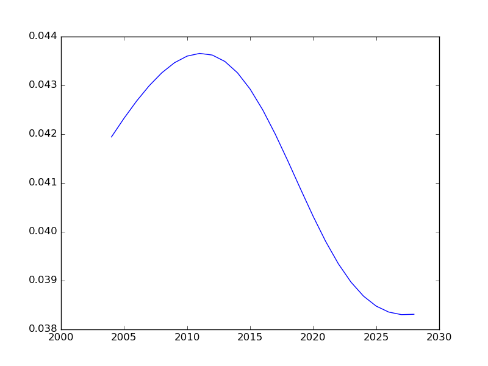
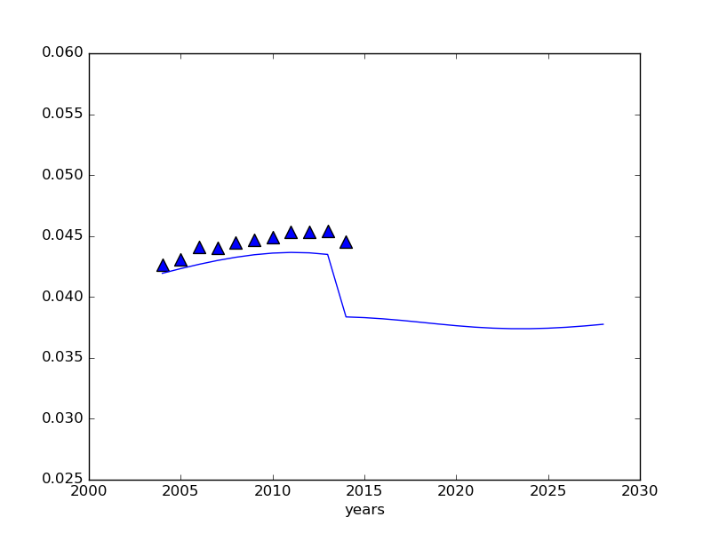
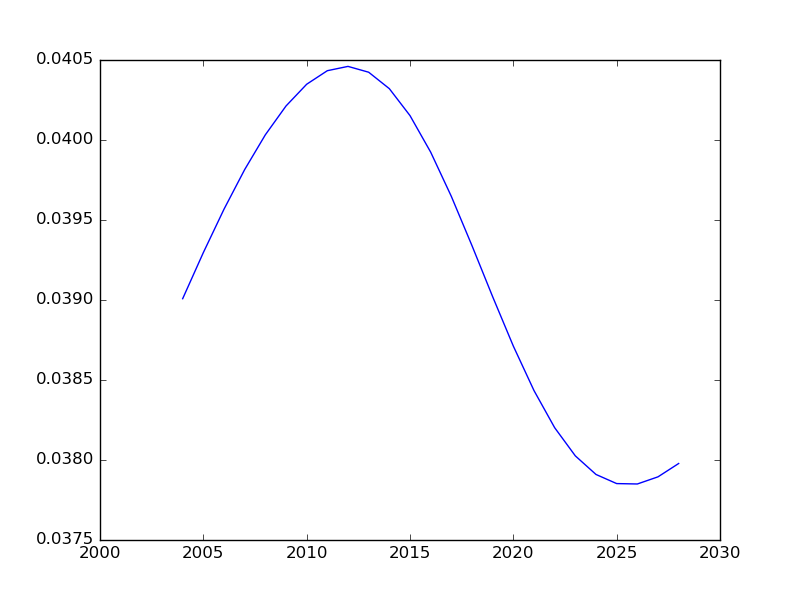

# 减少工业用水量

将工业用水降低50%

## 工业上调整

降低30%

因此降低工业用水将是可行的方案

具体实施细则

- 减少发展耗水型工业
- 增加耗水型工业产品(如炼钢)进口,降低税率
- 研发新技术减少工业耗水量

## 人口上的控制

- 少生优生,控制人口增长
    + 从2014年之后控制生长率为3%
- 城镇化

## 修建水利设置
- 修建水利设施,降低工业用水变化速率

AgricultureWater

population [ -1.308e+03   5.070e-02   3.425e+04]
PCGDP [ -1.496e+03   9.544e-03  -5.184e+05]
IrrigationArea [ -1.090e+03   3.202e-02  -9.094e+04]

p[0]+p[1]*(x-p[2])+var*normal

ResidentWater

population [ -1.690e+03   1.606e-02  -1.713e+04]
PCGDP [ -3.275e+02   2.847e-03  -3.426e+05]

p[0]+-p[1]*(x-p[2])+var*normal

IndustWater

Steel Production [  1.43783775e+03   5.49613554e-11   8.40052763e+04]
Population [  1.43387736e+03   7.61874825e-09   1.34410559e+05]
PCGDP [  1.44744343e+03   3.34730102e-10   3.30799980e+04]
Electricity [  1.44199462e+03   3.10130409e-10   4.45432350e+04]

p[0]*np.exp(-p[1]*(x-p[2])**2)+var*normal
