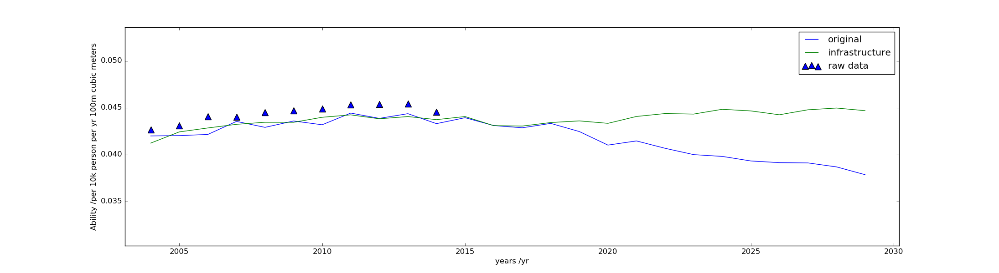

## intervention plan
As shown in our prediction. China will suffer from water scarcity in 15 years. Therefore we designed an intervention plan to avoid this situation. 

### Population Intervention
The huge population base has become the most serious problem in China and plays a leading role in China's water stress problem. To improve the ability of water supply family planning can play a significant role.  We decrease the population growth rate to 1% and the result is obvious.The ability increases by 0.001 up to 2030.

### Water Distribution Intervention
One of the most important issue in China's water allocation problem is the uneven distributed water resources. By developing infrastructure,a better water allocation will be possible to achieve.The ability increases by 0.002 up to 2030.
increase irrigation area by 30%

### Industrial Intervention
Virtual water has been a hot issue recently,which refers to the hidden flow of water if food or other commodities are traded from place to another. In our model, the water-consuming industry is evaluated by steel production. Therefore water stress can be alleviated by reducing steel production and import more steel. The result of reducing 30% of the steel production is shown in [fig], the ability increases by 0.0009.

decrease by 30%

### Overview
By comprehensive implementing the intervention plans, the ability of China increases by 0.004 up to 2030,as is shown in [fig].

### climate and uncertainty evaluation
In history, water scarcity also occurs when the climate changes. However, this probability of drought that is affect the whole region is pretty low. To estimate climeate affects and other uncertain issues, normal distributed random variables is added to every prominent parameters with corresponding variances, which is fitted from raw data. The variance of Ability shows the sensitivity of a given region.

The sensitivity of a given region can be reduced by constructing infrastructure such as reservoirs and dams. As is shown in [fig] the ability curve become more steady after constructing infrastructures.

 

### Disscussion
Any intervention plan has its weakness and will inevitably impact the surrounding areas. To be specific, in our intervention plan, there are some disadvantages:
- population control may cause population aging which may cause suppression to long-term economic development. And bad economic shape may lead to the lack of water conservancy facilities.
- water distribution intervention will be likely to impact water source's ecosystem, which is possible to cause future disasters.

Furthermore, the surrounding areas will suffer water scarcity or water stress by the result of:
- export virtual water, such as iron and steel trading.
- water conservancy facilities caused water scarcity for downstream regions, for instance, a dam on the upstream may cause lower water level in downstream.